==================================
Point source on top of a halfspace
==================================

.. image:: https://mybinder.org/badge_logo.svg
 :target: https://mybinder.org/v2/gh/nicoguaro/continuum_mechanics/master?filepath=docs%2Ftutorials%2Fpoint_source_halfspace.ipynb

 To illustrate the use of the package we are going to play with the
 solutions for a concentrated force located on top of a halfspace. The
 origin, :math:`\mathbf{x} = (0,0,0)`, is placed on the free surface and
 positive :math:`z` is inside the medium. This problem is of interest
 when modeling the deformation/stress around a localized load, e.g., the
 load caused by the weigth of a building on top of a soil.

 The derivations for the strain and stress tensors are not too difficult,
 but it can get cumbersome really fast because of the lengthy
 calculations. Using the package we can simplify the whole process.

.. code:: python

    import numpy as np
    from sympy import init_printing, symbols, lambdify, S, simplify
    from sympy import pi, Matrix, sqrt, oo
    from continuum_mechanics.solids import sym_grad, strain_stress

.. code:: python

    import matplotlib.pyplot as plt
    from matplotlib import colors

The following snippet allows to format the graphs.

.. code:: python

    repo = "https://raw.githubusercontent.com/nicoguaro/matplotlib_styles/master"
    style = repo + "/styles/minimalist.mplstyle"
    plt.style.use(style)

.. code:: python

    x, y, z, r, E, nu, Fx, Fy, Fz = symbols('x y z r E nu F_x F_y F_z')

    The components of the displacement vector are given by [LANDAU]_

.. math::

  \begin{align}
  &u_x = \frac{(1 + \nu)}{2 \pi E}  \left\{\left[\frac{xz}{r^3} - \frac{(1 - 2\nu)x}{r(r + z)}\right]F_z +
    \frac{2(1 - \nu)r +z}{r(r + z)}F_x  +\frac{[2r(\nu r + z) + z^2]x}{r^3(r + z)^2}(xF_x + y F_y)\right\}\, ,\\
  &u_y = \frac{(1 + \nu)}{2 \pi E}  \left\{\left[\frac{yz}{r^3} - \frac{(1 - 2\nu)y}{r(r + z)}\right]F_z +
    \frac{2(1 - \nu)r +z}{r(r + z)}F_y  +\frac{[2r(\nu r + z) + z^2]y}{r^3(r + z)^2}(xF_x + y F_y)\right\}\, ,\\
  &u_z = \frac{(1 + \nu)}{2 \pi E}  \left\{\left[\frac{2(1 - \nu)}{r} - \frac{z^2}{r^3}\right]F_z  +\left[\frac{1 - 2\nu}{r(r + z)} + \frac{z}{r^3}\right](xF_x +  y F_y)\right\}\, ,
  \end{align}

with :math:`r = \sqrt{x^2 + y^2 + z^2}`.

.. code:: python

    ux = (1+nu)/(2*pi*E)*((x*z/r**3 - (1-2*nu)*x/(r*(r + z)))*Fz +
                           (2*(1 - nu)*r + z)/(r*(r + z))*Fx +
                           ((2*r*(nu*r + z) + z**2)*x)/(r**3*(r + z)**2)*(x*Fx + y*Fy))
    ux

.. math::

    \frac{1}{2 \pi E} \left(\nu + 1\right) \left(\frac{F_{x}}{r \left(r + z\right)} \left(r \left(- 2 \nu + 2\right) + z\right) + F_{z} \left(- \frac{x \left(- 2 \nu + 1\right)}{r \left(r + z\right)} + \frac{x z}{r^{3}}\right) + \frac{x}{r^{3} \left(r + z\right)^{2}} \left(F_{x} x + F_{y} y\right) \left(2 r \left(\nu r + z\right) + z^{2}\right)\right)

.. code:: python

    uy = (1+nu)/(2*pi*E)*((y*z/r**3 - (1-2*nu)*y/(r*(r + z)))*Fz +
                           (2*(1 - nu)*r + z)/(r*(r + z))*Fy +
                           ((2*r*(nu*r + z) + z**2)*y)/(r**3*(r + z)**2)*(x*Fx + y*Fy))
    uy

.. math::

    \frac{1}{2 \pi E} \left(\nu + 1\right) \left(\frac{F_{y}}{r \left(r + z\right)} \left(r \left(- 2 \nu + 2\right) + z\right) + F_{z} \left(- \frac{y \left(- 2 \nu + 1\right)}{r \left(r + z\right)} + \frac{y z}{r^{3}}\right) + \frac{y}{r^{3} \left(r + z\right)^{2}} \left(F_{x} x + F_{y} y\right) \left(2 r \left(\nu r + z\right) + z^{2}\right)\right)

.. code:: python

    uz = (1+nu)/(2*pi*E)*((2*(1 - nu)/r + z**2/r**3)*Fz +
                           ((1 - 2*nu)/(r*(r + z)) + z/r**3)*(x*Fx + y*Fy))
    uz

.. math::

    \frac{1}{2 \pi E} \left(\nu + 1\right) \left(F_{z} \left(\frac{1}{r} \left(- 2 \nu + 2\right) + \frac{z^{2}}{r^{3}}\right) + \left(F_{x} x + F_{y} y\right) \left(\frac{- 2 \nu + 1}{r \left(r + z\right)} + \frac{z}{r^{3}}\right)\right)

Withouth loss of generality we can assume that :math:`F_y=0`, this is
equivalent a rotate the axes until the force is in the plane
:math:`y=0`.

.. code:: python

    ux = ux.subs(Fy, 0)
    ux

.. math::

    \frac{1}{2 \pi E} \left(\nu + 1\right) \left(\frac{Fx}{r \left(r + z\right)} \left(r \left(- 2 \nu + 2\right) + z\right) + \frac{Fx x^{2}}{r^{3} \left(r + z\right)^{2}} \left(2 r \left(\nu r + z\right) + z^{2}\right) + Fz \left(- \frac{x \left(- 2 \nu + 1\right)}{r \left(r + z\right)} + \frac{x z}{r^{3}}\right)\right)

.. code:: python

    uy = ux.subs(Fy, 0)
    uy

.. math::

    \frac{1}{2 \pi E} \left(\nu + 1\right) \left(\frac{Fx}{r \left(r + z\right)} \left(r \left(- 2 \nu + 2\right) + z\right) + \frac{Fx x^{2}}{r^{3} \left(r + z\right)^{2}} \left(2 r \left(\nu r + z\right) + z^{2}\right) + Fz \left(- \frac{x \left(- 2 \nu + 1\right)}{r \left(r + z\right)} + \frac{x z}{r^{3}}\right)\right)

.. code:: python

    uz = uz.subs(Fy, 0)
    uz

.. math::

    \frac{1}{2 \pi E} \left(\nu + 1\right) \left(Fx x \left(\frac{- 2 \nu + 1}{r \left(r + z\right)} + \frac{z}{r^{3}}\right) + Fz \left(\frac{1}{r} \left(- 2 \nu + 2\right) + \frac{z^{2}}{r^{3}}\right)\right)

The displacement vector is then

.. code:: python

    u = Matrix([ux, uy, uz]).subs(r, sqrt(x**2 + y**2 + z**2))

We can check that the displacement vanish when
:math:`x,y,z \rightarrow \infty`

.. code:: python

    u.limit(x, oo)

.. math::

    \left[\begin{matrix}0\\0\\0\end{matrix}\right]

.. code:: python

    u.limit(y, oo)

.. math::

    \left[\begin{matrix}0\\0\\0\end{matrix}\right]

.. code:: python

    u.limit(z, oo)

.. math::

    \left[\begin{matrix}0\\0\\0\end{matrix}\right]

We can compute the strain and stress tensors using the symmetric
gradient
(:py:func:`vector.sym_grad`)
and strain-to-stress
(:py:func:`solids.strain_stress`)
functions.

.. code:: python

    lamda = E*nu/((1 + nu)*(1 - 2*nu))
    mu = E/(2*(1 - nu))
    strain = sym_grad(u)
    stress = strain_stress(strain, [lamda, mu])

The expressions for strains and stresses are lengthy and difficult to
work with. Nevertheless, we can work with them. For example, we can
evaluate the stress tensor at a point :math:`\mathbf{x} = (1, 0, 1)` for
a vertical load and a Poisson coefficient :math:`\nu = 1/4`.

.. code:: python

    simplify(stress.subs({x: 1, y: 0, z:1, nu: S(1)/4, Fx: 0}))

.. math::

    \left[\begin{matrix}- \frac{F_{z} \left(73 \sqrt{2} + 108\right)}{48 \pi \left(7 + 5 \sqrt{2}\right)} & - \frac{5 F_{z} \left(2 \sqrt{2} + 3\right)}{24 \pi \left(7 + 5 \sqrt{2}\right)} & - \frac{5 F_{z} \left(4 + 3 \sqrt{2}\right)}{16 \pi \left(2 \sqrt{2} + 3\right)}\\- \frac{5 F_{z} \left(2 \sqrt{2} + 3\right)}{24 \pi \left(7 + 5 \sqrt{2}\right)} & - \frac{F_{z} \left(11 \sqrt{2} + 16\right)}{16 \pi \left(7 + 5 \sqrt{2}\right)} & 0\\- \frac{5 F_{z} \left(4 + 3 \sqrt{2}\right)}{16 \pi \left(2 \sqrt{2} + 3\right)} & 0 & - \frac{F_{z} \left(103 \sqrt{2} + 148\right)}{48 \pi \left(7 + 5 \sqrt{2}\right)}\end{matrix}\right]

Visualization of the fields
---------------------------

Since it is difficult to handle these lengthy expressions we can
visualize them. For that, we define a grid where to evaluate the
expressions,

.. math::  (x, z) \in [-2, 2]\times[0, 5]\, ,

in this case.

.. code:: python

    x_vec, z_vec = np.mgrid[-2:2:100j, 0:5:100j]

We can use
`lambdify() <https://docs.sympy.org/1.5.1/modules/utilities/lambdify.html>`__
to turn the SymPy expressions to evaluatable functions.

.. code:: python

    def field_plot(expr, x_vec, y_vec, z_vec, E_val, nu_val, Fx_val, Fz_val, title=''):
        """Plot the field"""

        # Lambdify the function
        expr_fun = lambdify((x, y, z, E, nu, Fx, Fz), expr, "numpy")
        expr_vec = expr_fun(x_vec, y_vec, z_vec, E_val, nu_val, Fx_val, Fz_val)

        # Determine extrema
        vmin = np.min(expr_vec)
        vmax = np.max(expr_vec)
        print("Minimum value in the domain: {:g}".format(vmin))
        print("Maximum value in the domain: {:g}".format(vmax))
        vmax = max(np.abs(vmax), np.abs(vmin))

        # Plotting
        fig = plt.gcf()
        levels = np.logspace(-1, np.log10(vmax), 10)
        levels = np.hstack((-levels[-1::-1], [0], levels))
        cbar_ticks = ["{:.2g}".format(level) for level in levels]
        cont = plt.contourf(x_vec, z_vec, expr_vec, levels=levels,
                            cmap="RdYlBu_r", norm=colors.SymLogNorm(0.1))
        cbar = fig.colorbar(cont, ticks=levels[::2])
        cbar.ax.set_yticklabels(cbar_ticks[::2])
        plt.axis("image")
        plt.gca().invert_yaxis()
        plt.xlabel(r"$x$")
        plt.ylabel(r"$z$")
        plt.title(title)
        return cont

Displacements
~~~~~~~~~~~~~

.. code:: python

    plt.figure()
    field_plot(u.norm(), x_vec, 0, z_vec, 1.0, 0.3, 0.0, 1.0)
    plt.show()

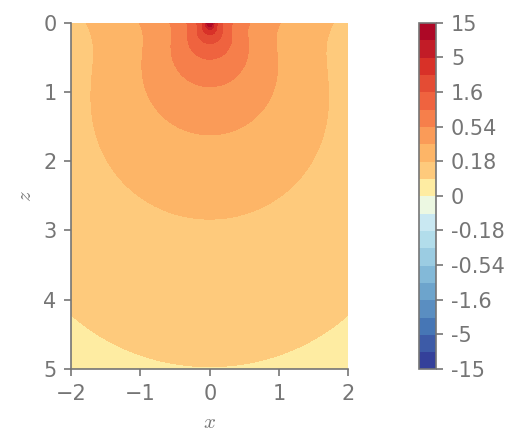

.. parsed-literal::

    Minimum value in the domain: 0.0881197
    Maximum value in the domain: 15.4645

.. code:: python

    plt.figure()
    field_plot(u[0], x_vec, 0, z_vec, 1.0, 0.3, 0.0, 1.0)
    plt.show()

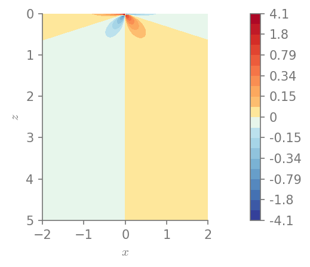

.. parsed-literal::

    Minimum value in the domain: -4.09665
    Maximum value in the domain: 4.09665

.. code:: python

    plt.figure()
    field_plot(u[2], x_vec, 0, z_vec, 1.0, 0.3, 0.0, 1.0)
    plt.show()

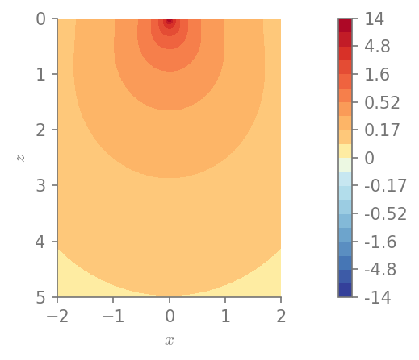

.. parsed-literal::

    Minimum value in the domain: 0.0869101
    Maximum value in the domain: 14.3383

Stresses
~~~~~~~~

We can plot the components of stress

.. code:: python

    for row in range(0, 3):
        for col in range(row, 3):
            plt.figure()
            field_plot(stress[row,col], x_vec, 0, z_vec, 1.0, 0.3, 0.0, 1.0,
                       title=r"$\sigma_{%i%i}$"%(row+1, col+1))

    plt.show()

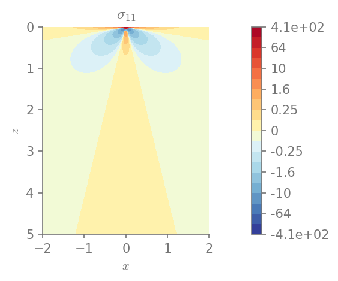

.. parsed-literal::

    Minimum value in the domain: -41.4274
    Maximum value in the domain: 406.682

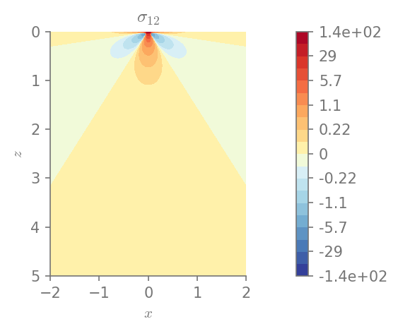

.. parsed-literal::

    Minimum value in the domain: -12.0021
    Maximum value in the domain: 144.846

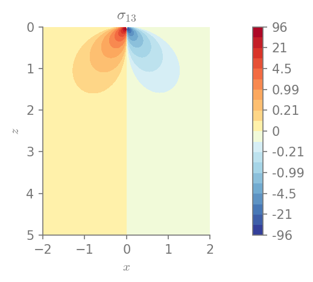

.. parsed-literal::

    Minimum value in the domain: -95.9472
    Maximum value in the domain: 95.9472

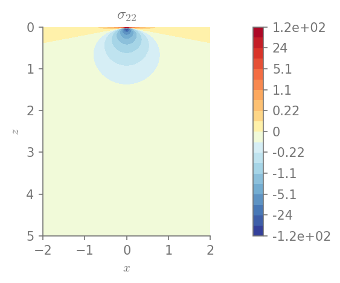

.. parsed-literal::

    Minimum value in the domain: -59.0538
    Maximum value in the domain: 116.991

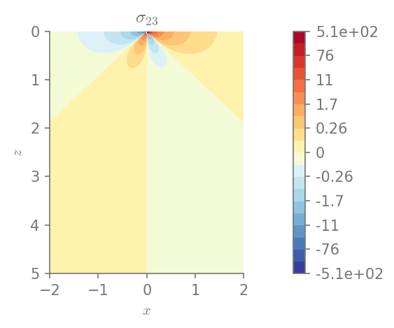

.. parsed-literal::

    Minimum value in the domain: -506.96
    Maximum value in the domain: 506.96

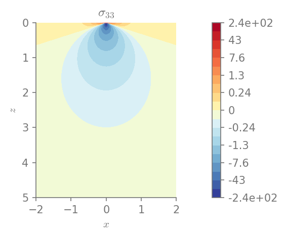

.. parsed-literal::

    Minimum value in the domain: -243.272
    Maximum value in the domain: 116.991

Stress invariants
~~~~~~~~~~~~~~~~~

We can also plot the invariants of the stress tensor

.. code:: python

    I1 = S(1)/3 * stress.trace()
    I2 = S(1)/2 * (stress.trace()**2 + (stress**2).trace())
    I3 = stress.det()
    Mises = sqrt(((stress[0,0] - stress[1,1])**2 + (stress[1,1] - stress[2,2])**2 +
                 (stress[2,2] - stress[0,0])**2 +
                 6*(stress[0,1]**2 + stress[1,2]**2 + stress[0,2]**2))/2)

.. code:: python

    plt.figure()
    field_plot(I1, x_vec, 0, z_vec, 1.0, 0.3, 0.0, 1.0)
    plt.show()

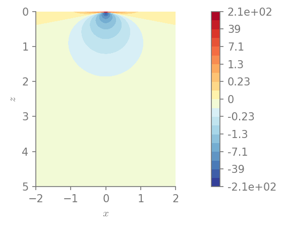

.. parsed-literal::

    Minimum value in the domain: -107.797
    Maximum value in the domain: 213.555

.. code:: python

    plt.figure()
    field_plot(I2, x_vec, 0, z_vec, 1.0, 0.3, 0.0, 1.0)
    plt.show()

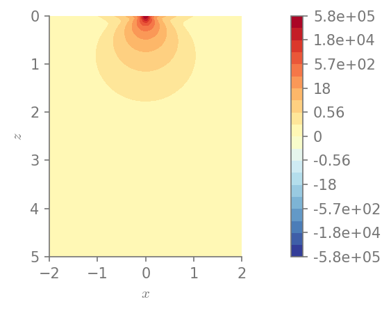

.. parsed-literal::

    Minimum value in the domain: 0.000977492
    Maximum value in the domain: 579596

.. code:: python

    plt.figure()
    field_plot(I3, x_vec, 0, z_vec, 1.0, 0.3, 0.0, 1.0)
    plt.show()

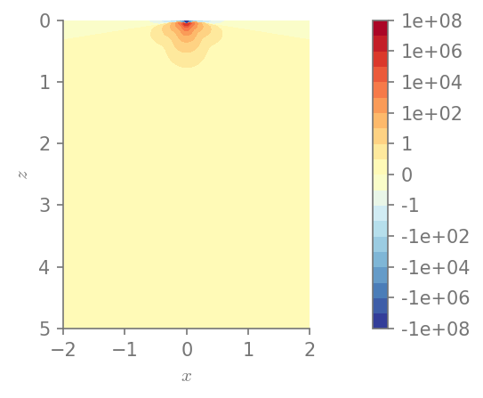

.. parsed-literal::

    Minimum value in the domain: -1.01409e+08
    Maximum value in the domain: 419218

.. code:: python

    plt.figure()
    field_plot(Mises, x_vec, 0, z_vec, 1.0, 0.3, 0.0, 1.0)
    plt.show()

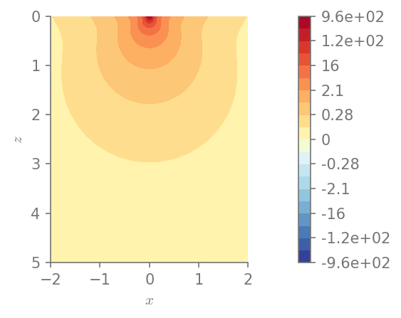

.. parsed-literal::

    Minimum value in the domain: 0.0274784
    Maximum value in the domain: 958.065

References
----------

.. [LANDAU]
    Landau, L. D., Kosevich, A. M., Pitaevskii, L. P., & Lifshitz, E. M.
       (1986). Theory of elasticity.
