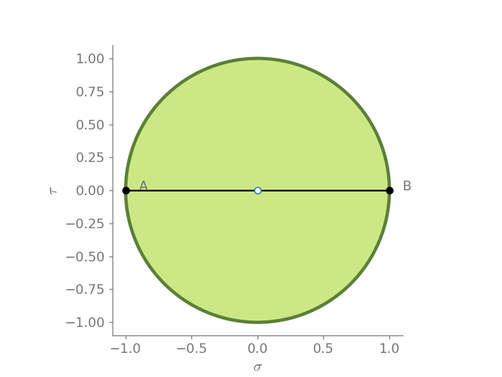
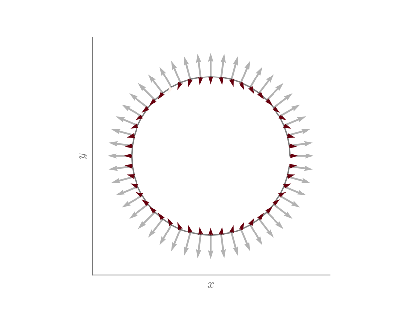
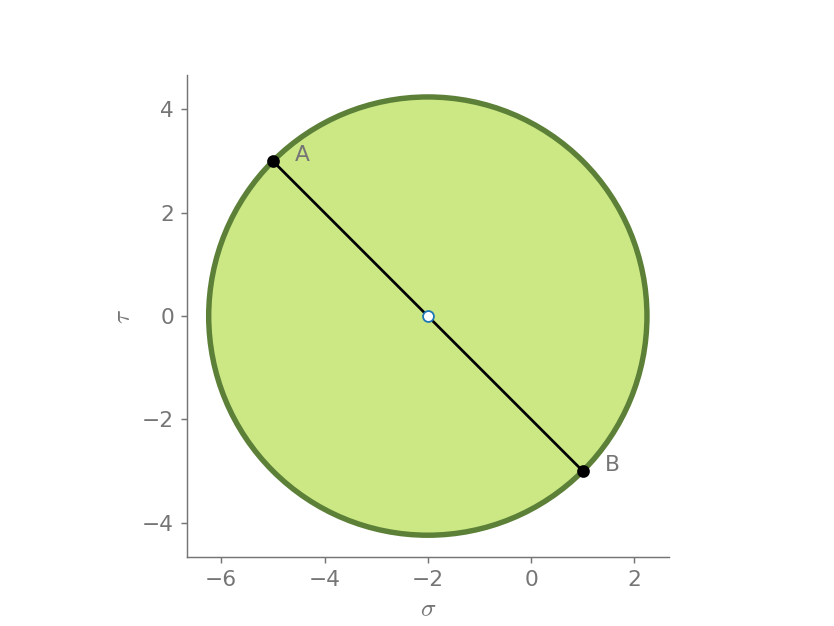
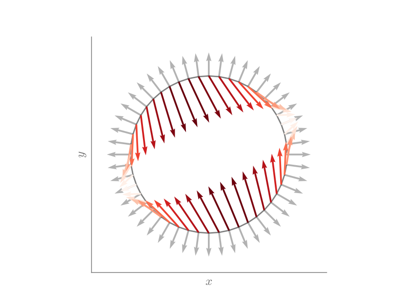
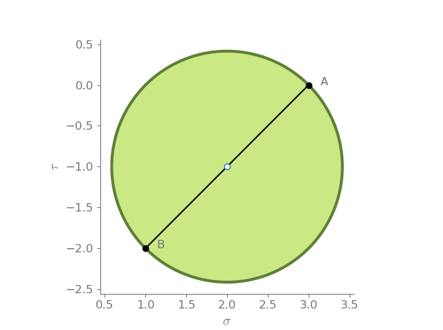
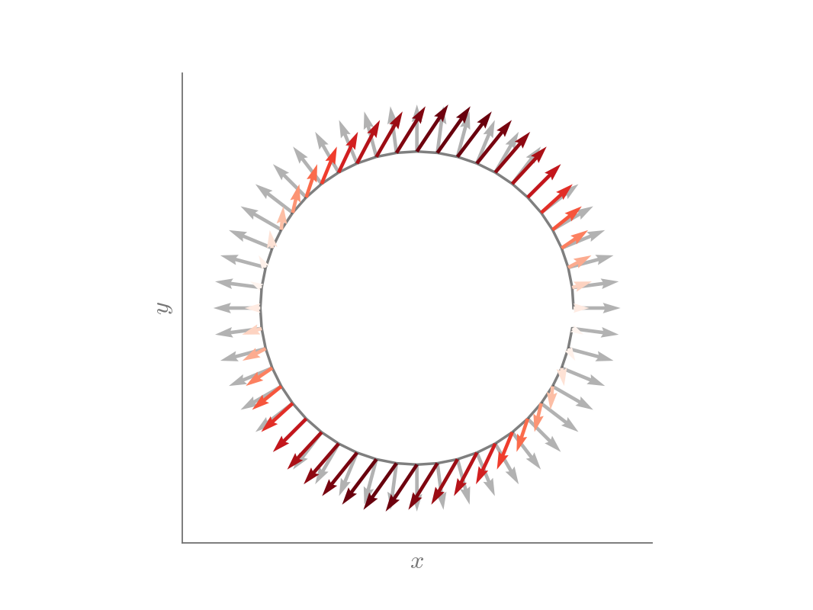
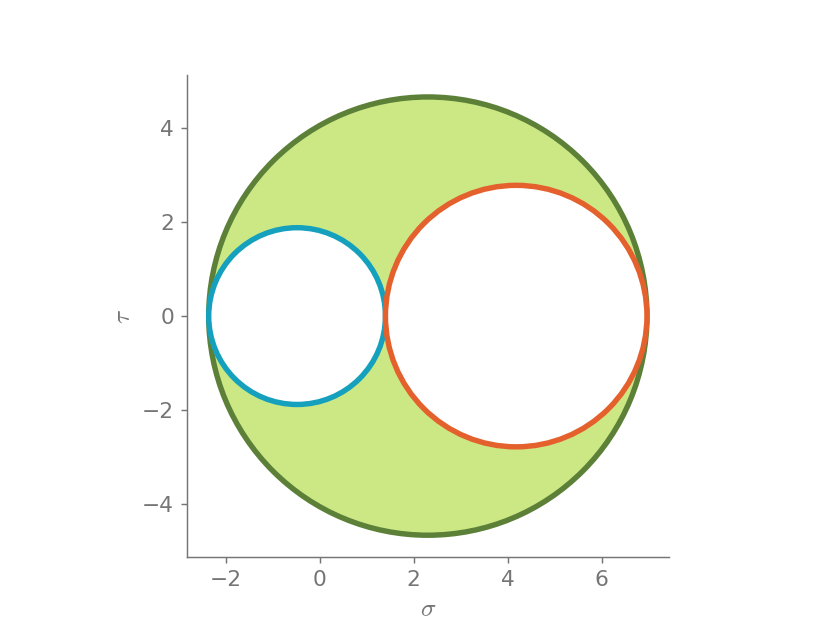
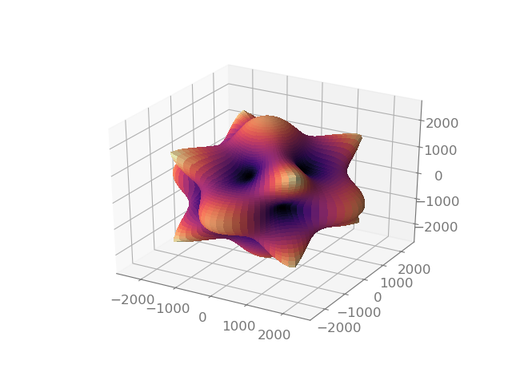
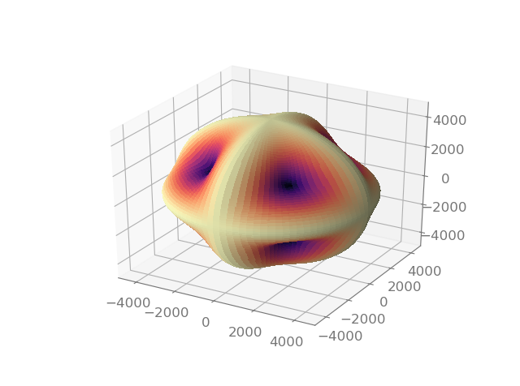
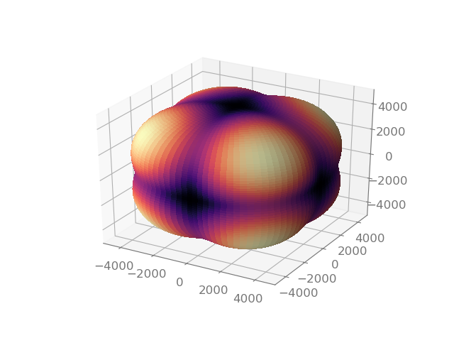

=====
Usage
=====

``continuum_mechanics`` relies on `SymPy <https://www.sympy.org/en/index.html>`_
for symbolic calculations. To use Continuum Mechanics in a project you can
import it as::

    import continuum_mechanics

Vector operators in Cartesian coordinates
-----------------------------------------

.. image:: https://mybinder.org/badge_logo.svg
 :target: https://mybinder.org/v2/gh/nicoguaro/continuum_mechanics/master?filepath=docs%2Fcartesian_coordinates.ipynb

``continuum_mechanics`` support major vector operators such as:

-  gradient of a scalar function;

-  divergence of a vector function;

-  curl of a vector function;

-  gradient of a vector function;

-  divergence of a tensor;

-  Laplace operator of a scalar function;

-  Laplace operator of a vector function; and

-  Biharmonic operator of a scalar function.

All these operators are in the module ``vector``.

.. code:: python

    from sympy import *
    from continuum_mechanics import vector

By default, Cartesian coordinates are given by :math:`x`, :math:`y` and
:math:`z`. If these coordinates are used there is not necessary to
specify them when calling the vector operators

.. code:: python

    init_printing()
    x, y, z = symbols("x y z")

Following, we have some examples of vector operators in Cartesian
coordinates.

Gradient of a scalar function
~~~~~~~~~~~~~~~~~~~~~~~~~~~~~

The gradient takes as input a scalar and returns a vector, represented
by a 3 by 1 matrix.

.. code:: python

    f = 2*x + 3*y**2 - sin(z)
    f

.. math::

    2 x + 3 y^{2} - \sin{\left (z \right )}

.. code:: python

    vector.grad(f)

.. math::

    \left[\begin{matrix}2\\6 y\\- \cos{\left (z \right )}\end{matrix}\right]

Divergence of a vector function
~~~~~~~~~~~~~~~~~~~~~~~~~~~~~~~

The divergence takes as input a vector (represented by a 3 by 1 matrix)
and returns a scalar.

.. code:: python

    vector.div(Matrix([x, y, z]))

.. math::

    3

.. code:: python

    vector.div(Matrix([
        x**2 + y*z,
        y**2 + x*z,
        z**2 + x*y]))

.. math::

    2 x + 2 y + 2 z

Divergence of a tensor function
~~~~~~~~~~~~~~~~~~~~~~~~~~~~~~~

The divergence of a tensor (represented by a 3 by 3 matrix) returns a
vector.

.. code:: python

    Axx, Axy, Axz = symbols("A_xx A_xy A_xz", cls=Function)
    Ayx, Ayy, Ayz = symbols("A_yx A_yy A_yz", cls=Function)
    Azx, Azy, Azz = symbols("A_zx A_zy A_zz", cls=Function)

.. code:: python

    tensor = Matrix([
        [Axx(x, y, z), Axy(x, y, z), Axz(x, y, z)],
        [Ayx(x, y, z), Ayy(x, y, z), Ayz(x, y, z)],
        [Azx(x, y, z), Azy(x, y, z), Azz(x, y, z)]])
    tensor

.. math::

    \begin{bmatrix}
    A_{xx}(x,y,z) & A_{xy}(x,y,z) & A_{xz}(x,y,z)\\
    A_{yx}(x,y,z) & A_{yy}(x,y,z) & A_{yz}(x,y,z)\\
    A_{zx}(x,y,z) & A_{zy}(x,y,z) & A_{zz}(x,y,z)
    \end{bmatrix}

.. code:: python

    vector.div_tensor(tensor)

.. math::

    \left[\begin{matrix}
    \frac{\partial}{\partial x} A_{xx}(x, y, z) + \frac{\partial}{\partial y} A_{xy}(x, y, z) + \frac{\partial}{\partial z} A_{xz}(x, y, z)\\
    \frac{\partial}{\partial x} A_{yx}(x, y, z) + \frac{\partial}{\partial y} A_{yy}(x, y, z) + \frac{\partial}{\partial z} A_{yz}(x, y, z)\\
    \frac{\partial}{\partial x} A_{zx}(x, y, z) + \frac{\partial}{\partial y} A_{zy}(x, y, z) + \frac{\partial}{\partial z} A_{zz}(x, y, z)
    \end{matrix}\right]

Curl of a vector function
~~~~~~~~~~~~~~~~~~~~~~~~~

Let us check the identity

.. math:: \nabla \times \nabla f(x, y, z) = 0\, .

.. code:: python

    fun = symbols("fun", cls=Function)
    vector.curl(vector.grad(fun(x, y, z)))

.. math::

    \left[\begin{matrix}0\\0\\0\end{matrix}\right]

Visualization of tensors
------------------------

.. image:: https://mybinder.org/badge_logo.svg
 :target: https://mybinder.org/v2/gh/nicoguaro/continuum_mechanics/master?filepath=docs%2Fvisualization.ipynb

.. code:: python

    from sympy import Matrix
    from continuum_mechanics.visualization import mohr2d, mohr3d, traction_circle

Visualization in 2D
~~~~~~~~~~~~~~~~~~~

First, let us visualize the tensor

.. math::

   \begin{bmatrix}
   1 &0\\
   0 &-1
   \end{bmatrix}\, .

.. code:: python

    mohr2d(Matrix([
      [1,0],
      [0,-1]]))

From the Mohr circle, we can see that the principal directions are given
at :math:`0` and :math:`\pi/2` radians. This can be more easily
visualized using the traction circle, where normal vectors are presented
in light gray and the traction vectors are presented in colors.

.. code:: python

    traction_circle(Matrix([
      [1,0],
      [0,-1]]))

Now, let us visualize

.. math::

   \begin{bmatrix}
   1 &3\\
   3 &-5
   \end{bmatrix}\, .

.. code:: python

    mohr2d(Matrix([
      [1, 3],
      [3, -5]]))

.. code:: python

    traction_circle(Matrix([
      [1, 3],
      [3, -5]]))

Now, let us try it with an asymmetric tensor

.. math::

    \begin{bmatrix}
    1 &2\\
    0 &3
    \end{bmatrix}\, .

.. code:: python

    mohr2d(Matrix([
      [1, 2],
      [0, 3]]))

.. code:: python

    traction_circle(Matrix([
      [1, 2],
      [0, 3]]))

Mohr Circle in 3D
~~~~~~~~~~~~~~~~~~~

Let us visualize the tensor

.. math::

   \begin{bmatrix}
   1 &2 &4\\
   2 &2 &1\\
   4 &1 &3
   \end{bmatrix}\, .

.. code:: python

    mohr3d(Matrix([
        [1, 2, 4],
        [2, 2, 1],
        [4, 1, 3]]))

Now, let us visualize the tensor

.. math::

   \begin{bmatrix}
   1 &0 &0\\
   0 &2 &0\\
   0 &0 &3
   \end{bmatrix}\, .

.. code:: python

    mohr3d(Matrix([
        [1, 0, 0],
        [0, 2, 0],
        [0, 0, 3]]))

.. image:: img/mohr3d_2.png
  :width: 600px
  :align: center

Elasticity tensor visualization
~~~~~~~~~~~~~~~~~~~~~~~~~~~~~~~

Let us consider β-brass that is a cubic material and
has the following material properties in Voigt notation:

.. math::
    C_{11} = 52\text{ GPa},\quad
    C_{12} = 27.5\text{ GPa},\quad
    C_{44} = 173\text{ GPa}.

.. code:: python

    C11 = 52e9
    C12 = 27.5e9
    C44 = 173e9
    rho = 7600
    C = np.zeros((6, 6))
    C[0:3, 0:3] = np.array([[C11, C12, C12],
                            [C12, C11, C12],
                            [C12, C12, C11]])
    C[3:6, 3:6] = np.diag([C44, C44, C44])

One way to visualize a stiffness tensor is to use the
Christofel equation

.. math::

    \det(\Gamma_{ij} - v_p^2\delta_{ij}) = 0\, ,

where :math:`\Gamma_{ij}` is the Christofel stiffness and depends
on the material properties (:math:`c_{ijkl}`) and unit vectors
(:math`n_i`):

.. math:

    \Gamma_{ij} = c_{iklj}n_k n_l\, .

This provides the eigenvalues that represent the phase
speed for three propagation modes in the material.

.. code:: python

    V1, V2, V3, phi_vec, theta_vec = christofel_eig(C, 100, 100) 
    V1 = np.sqrt(V1/rho)
    V2 = np.sqrt(V2/rho)
    V3 = np.sqrt(V3/rho)

Phase speed for the first quasi-transverse mode.

Phase speed for the second quasi-transverse mode.

Phase speed for the quasi-longitudinal mode.

